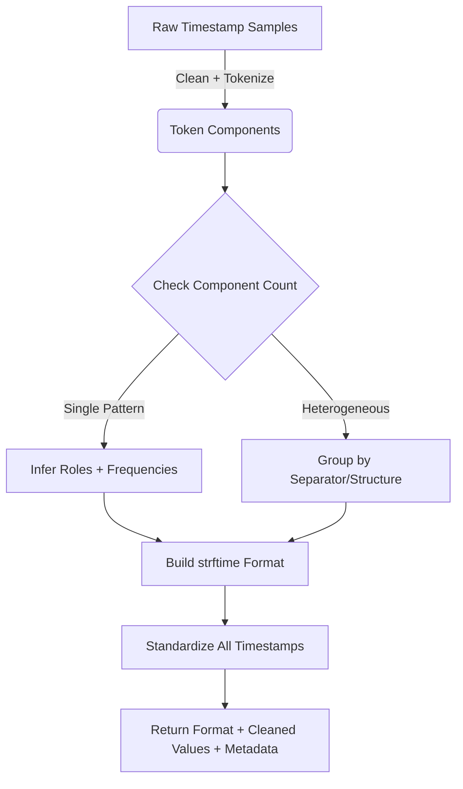

# How Formatify Thinks About Timestamps

Just a quick note on how the core logic of `formatify` works, what design choices we made, and why it’s built the way it is.

---

## 🧭 Why This Exists

Parsing timestamps in the wild is messy:

* Formats are all over the place — ISO 8601, text months, slashes, dashes, milliseconds
* No schema means you have to infer intent
* Built-in tools like `pandas.to_datetime()` are useful but not transparent or configurable

So we built something lean and explicit — especially useful for logs, ETL pipelines, and data validation steps.

---

## ✅ What We Chose To Do

* Use **regex + tokenization** instead of fuzzy parsing
* Look at **how often parts change** (e.g., days vs. years) to guess roles
* Support **epoch timestamps** (10 or 13 digit UNIX time)
* Preserve real delimiters (`/`, `-`, `T`) for accurate format reconstruction
* Group inconsistent timestamp sets by their structure if needed

And we return:

* A usable `strftime` format string
* Standardized timestamps in a common format
* Some light metadata (accuracy, timezone, roles)

---

## 💡 What We Didn’t Use

We intentionally skipped tools like:

* `dateutil.parser` → too magic, hard to debug
* `pandas.to_datetime()` → doesn’t infer format, can silently fail
* NLP-style libraries (like `chrono`) → great for natural language, but overkill for logs/CSV

---

## 📉 Tradeoffs

👍 Pros:

* Fast
* Easy to reason about
* Plays nice with your data pipeline

👎 Cons:

* No locale support (e.g. `1 Mars 2023`)
* Not built for unstructured natural language
* Not a fuzzy parser — it’s deterministic

---

## 🧱 How It All Fits Together

---

## 🧠 TL;DR

`formatify` is built to be:

* Explicit, inspectable, and reliable
* Not too smart — but smart enough
* A small, transparent layer you can drop into any data workflow

Future ideas:

* Locale extensions
* Web + CLI interface
* More robust timezone parsing

Want to contribute? Just read the code — it’s built to be understood.
